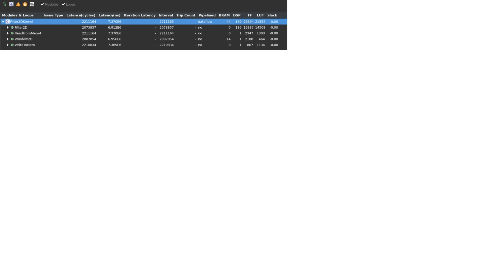
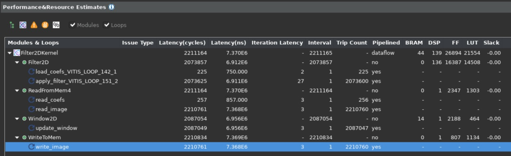

# Design and Analysis of Hardware Kernel Module for 2-D Video Convolution Filter
The focus of this lab will be to illustrate the design of convolutional filter module, analyze its performance and hardware resource utilization. We are following a bottom up approach here by first designing the hardware block and analyzing its performance before integrating the whole system for accelerating the application. We will use Vitis HLS to build and estimate the performance.
## 2-D Convolution Filter Implementation
This section discuses the design of convolution filter in detail. It goes through top level structure, optimizations and implementation details.
### Top Level Structure of Kernel
The top level of convolution filter is modeled dataflow process consisting of four different functions as given below, for full implementation details you can refer to source file that is in **"src/filter2d_hw.cpp"**.

```cpp
void Filter2DKernel(
        const char           coeffs[256],
        float                factor,
        short                bias,
        unsigned short       width,
        unsigned short       height,
        unsigned short       stride,
        const unsigned char  src[MAX_IMAGE_WIDTH*MAX_IMAGE_HEIGHT],
        unsigned char        dst[MAX_IMAGE_WIDTH*MAX_IMAGE_HEIGHT])
  {
            
#pragma HLS DATAFLOW

	// Stream of pixels from kernel input to filter, and from filter to output
    hls::stream<char,2>    coefs_stream;
    hls::stream<U8,2>      pixel_stream;
    hls::stream<window,3>  window_stream; // Set FIFO depth to 0 to minimize resources
    hls::stream<U8,64>     output_stream;

	// Read image data from global memory over AXI4 MM, and stream pixels out
    ReadFromMem(width, height, stride, coeffs, coefs_stream, src, pixel_stream);

    // Read incoming pixels and form valid HxV windows
    Window2D(width, height, pixel_stream, window_stream);

	// Process incoming stream of pixels, and stream pixels out
	Filter2D(width, height, factor, bias, coefs_stream, window_stream, output_stream);

	// Write incoming stream of pixels and write them to global memory over AXI4 MM
	WriteToMem(width, height, stride, output_stream, dst);

  }

```
Dataflow chain consists of four different functions as follows:

- **ReadFromMem**: reads pixel data or video input from main memory
- **Window2D**:  local cache with wide(15x15 pixels) access on output side
- **Filter2D**:  core kennel filter algorithm
- **WriteToMem**:  writes output data to main memory

Two function at the input and output are very typical modules that read and write data from the memory connecting it with the accelerator. The data read from the main memory is passed to Window2D function which creates a local cache and on every cycle provided a 15x15 pixel sample to filter function/block which can consume it in single cycle to perform @check 225(15x15) MACs per cycle. Please open and have a look at the implementation details of these individual functions. In next section we will elaborate on the implementation details of Window2D and Filter2D functions. 
      

###Data Mover
One of the key advantage that comes with the design custom hardware accelerated for which FPGAs are well suited for many reasons is the choice and architecture of custom data movement schemes. Specialized blocks at the interface with main memory can be built at the input and output of the data processing engine or processing elements. Convolutional filter is a very good example of this. Looking from pure software implementation point of view at the source code it seems that to produce single sample at the output side it requires 450 memory accesses and 1 access to write to output.
```bash
Memory Accesses to Read filter Co-efficients = 15x15 = 225
Memory Accesses to Read Neighbouring Pixels  = 15x15 = 225
Memory Acceeses to Write to Output           = 1
Total Memory Acccesses                       = 451 
```  

Even though many of these accesses can become fast because of caching but still large number of memory accesses will be a performance bottleneck. But while designing on FPGA clever data movement and access schemes can be built easily. One of the key and major advantage is availability of huge on-chip memory bandwidth( distributed and block memory) and choice of custom configuration of this bandwidth. In the next section we will elaborate on the design of  "Window2D" block which is essentially an input side data mover facing kernel processing engine. 
#### Window2D : Line and Window Buffers
The Windows2D block is essentially built from two basic blocks, one is a line buffer that can buffer multiple lines of full image and specifically here it is designed to buffer (Filter Height(FILTER_V_SIZE in code) - 1) full image lines. The total number of pixels held by line buffer are **(FILTER_V_SIZE-1) *  MAX_IMAGE_WIDTH**. The other blocks is "Window" which hold **FILTER_V_SIZE * FILTER_H_SIZE** pixels. The 2-D convolution filtering operation consists of centering the filtering mask(filter co-efficients) on the index of output pixel and calculating the sum of product(SOP) as described in the previous lab also. Following figure shows how this centering and SOP is carried. 
         
 The figure above shows SOP carried out with reference to full image being processed but if we look carefully when output pixels are produced line by line, it is not required to have all the image pixels in memory but only the line where filtering mask overlaps are required which is essentially (FILTER_V_SIZE) which even can be reduced to FILTER_V_SIZE-1. Essentially that is amount of the data that needs to be on-chip or housed by data mover at any given time.

    
 
 The figure above illustrates the operation and requirements for a line and widow buffer. The images size is assumed 8x8 and the filter size is 3x3. Assume we are generating output pixel number 10, for this what we need is 3x3 block of input pixels centered around it as shown by step "A". Step B in figure highlights what is required for producing pixel number 11 again a 3x3 block but it has a significant overlap with previous input block. Essentially a column moves out from left and a column moves in from right. One important thing to identify between steps A,B and C is that from input side it only needs one new pixel to produce one output (ignoring the initially latency of filling line buffer with multiple pixels which is one time only). Give all these observations Window2D is implemented using a line buffer which holds FILTER_V_SIZE-1 lines ( In general it requires FILTER_V_SIZE lines but a line is reduced by using line buffer in circular fashion and by exploiting the fact that pixels at the start of first line buffer can be used to write new in-coming pixels since they are no longer needed). The window buffer is implemented as FILTER_V_SIZE * FILTER_H_SIZE storage fully partitioned. The data moves as a column vector of size FILTER_V_SIZE from line buffer to window buffer and then this whole widow is passed through a stream to Filter2D function for processing. The overall scheme (data mover) is built to maximize the data re-usa providing maximum parallel data to processing element.
 
    
 
 The figure above illustrates the operation and requirements for a line and widow buffer. The images size is assumed 8x8 and the filter size is 3x3. Assume we are generating output pixel number 10, for this what we need is 3x3 block of input pixels centered around it as shown by step "A". Step B in figure highlights what is required for producing pixel number 11 again a 3x3 block but it has a significant overlap with previous input block. Essentially a column moves out from left and a column moves in from right. One important thing to identify between steps A,B and C is that from input side it only needs one new pixel to produce one output (ignoring the initially latency of filling line buffer with multiple pixels which is one time only). Give all these observations Window2D is implemented using a line buffer which holds FILTER_V_SIZE-1 lines ( In general it requires FILTER_V_SIZE lines but a line is reduced by using line buffer in circular fashion and by exploiting the fact that pixels at the start of first line buffer can be used to write new in-coming pixels since they are no longer needed). The window buffer is implemented as FILTER_V_SIZE * FILTER_H_SIZE storage fully partitioned. The data moves as a column vector of size FILTER_V_SIZE from line buffer to window buffer and then this whole widow is passed through a stream to Filter2D function for processing. The overall scheme (data mover) is built to maximize the data re-usa providing maximum parallel data to processing element. To have a deeper understanding on the modeling style and minute details of data mover please have a look at the Window2D function implementation details in provided source code file named "filter2d_hw.cpp".
 
 ## Building and Simulating the Kernel using Vitis HLS
 In this section we will build and simulate the 2D convolution filter using Vitis HLs and also look at the performance estimates and measured results after co-simulation for comparison with target performance settings. 
 ### Building Kernel Module
 Here you will build kernel module as an isolated module with AXI interfaces to memory and also simulate it. To do this please follow the steps listed below:
 
 ```bash
    cd  hls_build
    vitis_hls -f build.tcl 
```
An output similar to the following will be printed:
```bash
    ----------------------------------------------------------------------------
    HLS Testbench for Xilinx 2D Filter Example
    Image info
    - Width     :       1000
    - Height    :         30
    - Stride    :       1024
    - Bytes     :      30720
    Running FPGA accelerator
    Comparing results
    Test PASSED: Output matches reference
    ----------------------------------------------------------------------------
    INFO: [COSIM 212-1000] *** C/RTL co-simulation finished: PASS ***
```
which shows an image with Width=1000 and height=30 is simulated. There are default parameter for image dimensions and kept as small values to make co-simulation run in reasonable time and not take too long. The synthesis is done for a max. image size of 1020x1080.
 Once the build and simulation is finished launch Vitis HLS GUI to analyze the performance estimates reports and implementation QoR as follows:
 
```bash
vitis_hls -p 
 ```
After GUI opens first thing to notice is the resource consumption report as shown below:

    

It shows that usage of 139 DSP essentially for SOP by top level module and also notice the use of 14 BRAMs by Window2D data mover block. One important thing to notice is the static performance estimate for kernel which is 7.3 ms , very close to the estimated target latency for kernel which was 6.9 ms as calculated in previous lab. Another thing that we can use to get an accurate measurement of latency for kernel is to have a look at the co-simulation report.  You can go to reports menu in Vitis HLS and open co-simulation report it will show something as follows:

    


Since we are simulating and image of 1000x30 so expected latency should be: 30,000 + fixed latency of some blocks. The number shown in the report is 38,520. Here 8520 is the fixed latency and when the image size is actually 1920x1080 it will get amortized on more number of image lines. The fact that large image will amortize the latency can be verified by simulating with larger image. Another thing that verifies that the kernel can achieve 1 output sampler per cycle throughput is loop initiation intervals. The synthesis report expanded view shows this below( all loops have II=1):

   

Once we have verified the throughput requirements are met and the resource consumption is acceptable we can move forward and start integrating the whole system. Which will consists of host application to drive the kernel and actually kernel building using one of the Xilinx platform for Alveo Data center cards.

In this lab you learnt about:
- Optimized implementation of convolution filter
- Building and kernel performance analysis using Vitis HLS

