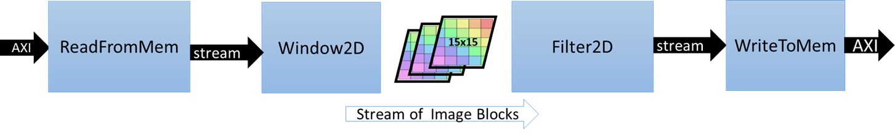

# Design and Analysis of Hardware Kernel Module for 2-D Video Convolution Filter
The focus of this lab will be to illustrate the design of convolutional filter module, analyze its performance and hardware resource utilization. We are following a bottom up approach here by first designing the hardware block and analyzing its performance before integrating the whole system for accelerating the application. We will use Vitis HLS to build and estimate the performance.
## 2-D Convolution Filter Implementation
This section discuses the design of convolution filter in detail. It goes through top level structure, optimizations and implementation details.
### Top Level Structure of Kernel
The top level of convolution filter is modeled dataflow process consisting of four different functions as given below, for full implementation details you can refer to source file that is in **"src/filter2d_hw.cpp"**.

```bash
void Filter2DKernel(
        const char           coeffs[256],
        float                factor,
        short                bias,
        unsigned short       width,
        unsigned short       height,
        unsigned short       stride,
        const unsigned char  src[MAX_IMAGE_WIDTH*MAX_IMAGE_HEIGHT],
        unsigned char        dst[MAX_IMAGE_WIDTH*MAX_IMAGE_HEIGHT])
  {
            
#pragma HLS DATAFLOW

	// Stream of pixels from kernel input to filter, and from filter to output
    hls::stream<char,2>    coefs_stream;
    hls::stream<U8,2>      pixel_stream;
    hls::stream<window,3>  window_stream; // Set FIFO depth to 0 to minimize resources
    hls::stream<U8,64>     output_stream;

	// Read image data from global memory over AXI4 MM, and stream pixels out
    ReadFromMem(width, height, stride, coeffs, coefs_stream, src, pixel_stream);

    // Read incoming pixels and form valid HxV windows
    Window2D(width, height, pixel_stream, window_stream);

	// Process incoming stream of pixels, and stream pixels out
	Filter2D(width, height, factor, bias, coefs_stream, window_stream, output_stream);

	// Write incoming stream of pixels and write them to global memory over AXI4 MM
	WriteToMem(width, height, stride, output_stream, dst);

  }

```
Dataflow chain consists of four different functions as follows:

- **ReadFromMem**: reads pixel data or video input from main memory
- **Window2D**:  local cache with wide(15x15 pixels) access on output side
- **Filter2D**:  core kennel filter algorithm
- **WriteToMem**:  writes output data to main memory

Two function at the input and output are very typical modules that read and write data from the memory connecting it with the accelerator. The data read from the main memory is passed to Window2D function which creates a local cache and on every cycle provided a 15x15 pixel sample to filter function/block which can consume it in single cycle to perform 225(15x15) MACs per cycle. Please open and have a look at the implementation details of these individual functions. In next section we will elaborate on the implementation details of Window2D and Filter2D functions. 
      
Lab 2:  ( Using bottom up flow design a kernel, estimate its performance)

    Synthesizing software like kernel vs. Optimized kernel
    Coding the kernel
    Post synthesis analysis and other vitis_hls features that can be useful for bottom up flow
    >>Simulating the kernel if possible 
    Discuss harware optimization applicable to kernel.
    Compare kernel based on line-buffer vs. simple buffer
