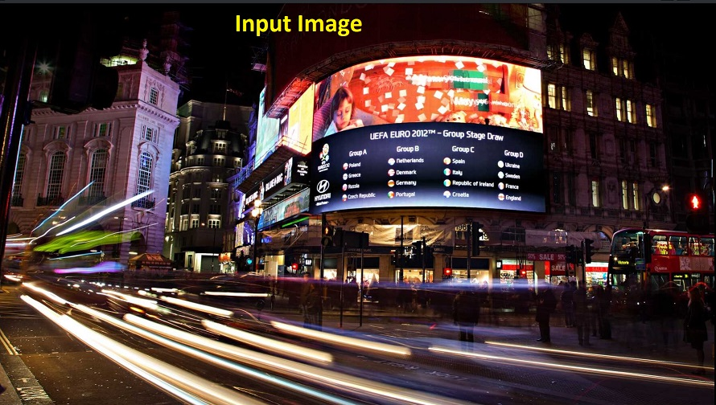
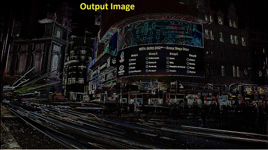
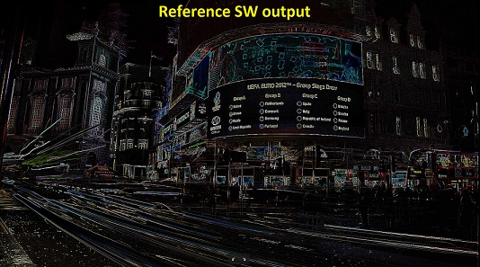
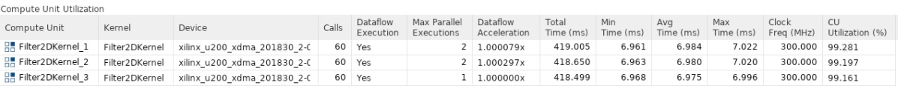
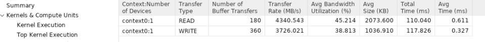
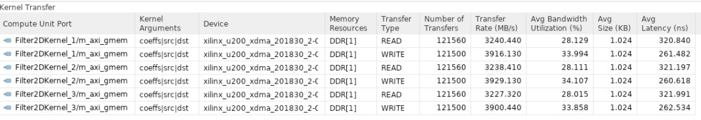
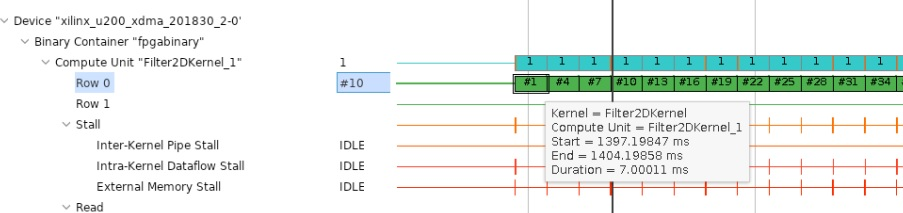
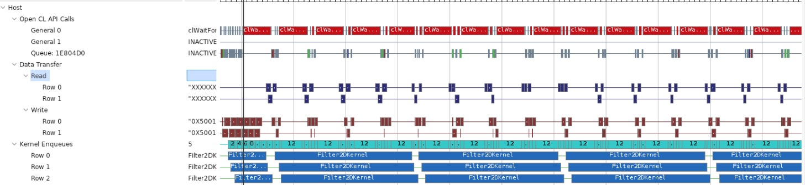

<table>
 <tr>
   <td align="center"><h1>2020.1 Vitis™ Application Acceleration Development Flow Tutorials</h1>
   <a href="https://github.com/Xilinx/Vitis-Tutorials/branches/all">See 2019.2 Vitis Application Acceleration Development Flow Tutorials</a>
   </td>
 </tr>
 <tr>
 <td align="center"><h1>Accelerating Video Convolution Filtering Application
 </td>
 </tr>
</table>

# Building the 2-D convolutional Kernel and Host Application
The lab will focus on building a hardware kernel using Vitis for Xilinx provided platform for U200 card. A host-side application will be implemented that will coordinate all the data movements and execution triggers for invoking the kernel. During this lab, real performance measurements will be taken and compared to estimated performance and the CPU-only performance.

## Host Application
This section briefly discusses how host application is written to orchestrate the execution of a convolutional kernel. As it was estimated in the previous lab that to meet the performance constraints of 1080p HD Video multiple compute units will be needed. The host application is designed to be agnostic to the number of compute units. More specifically if the compute units are symmetric ( instance of the same kernel and memory connectivity to device DDR banks is identical) the host application can deal with any number of compute units. Other tutorials about [host programming and Vitis](https://github.com/Xilinx/Vitis-Tutorials) are also available.

### Host Application Variants
Please go to the top-level folder for the convolution tutorial and change the directory to "src" and do the listing of files:
```bash
cd src
ls
```
There are two files namely "**host.cpp**" and "**host_randomized.cpp**". They can be used to build two different versions of the host application. The way they interact with the kernel compute unit is exactly the same except that one uses **pgm** image file as input. This file is repeated multiple times to emulate an image sequence(video). The randomized host uses a randomly generated image sequence. The host with random input image generation has no dependencies whereas the host code in "**host.cpp**" uses OpenCV libraries, specifically it uses **OpenCV 2.4** libraries to load, unload and convert between raw image formats.

### Host Application Details
The host application starts by parsing command line arguments. Following are the command-line options provided by the host that takes input image and uses OpenCV(in source file "src/host.cpp"):

```cpp
  CmdLineParser parser;
  parser.addSwitch("--nruns",   "-n", "Number of times the image is processed", "1");
  parser.addSwitch("--fpga",    "-x", "FPGA binary (xclbin) file to use");
  parser.addSwitch("--input",   "-i", "Input image file");
  parser.addSwitch("--filter",  "-f", "Filter type (0-6)", "0");
  parser.addSwitch("--maxreqs", "-r", "Maximum number of outstanding requests", "3");
  parser.addSwitch("--compare", "-c", "Compare FPGA and SW performance", "false", true);
```
The other host file(in source file "host_randomized.cpp") that uses randomized input data as images provides the following command line options:
```cpp
  CmdLineParser parser;
  parser.addSwitch("--nruns",   "-n", "Number of times to image is processed", "1");
  parser.addSwitch("--fpga",    "-x", "FPGA binary (xclbin) file to use");
  parser.addSwitch("--width",   "-w", "Image width",  "1920");
  parser.addSwitch("--height",  "-h", "Image height", "1080");
  parser.addSwitch("--filter",  "-f", "Filter type (0-6)", "0");
  parser.addSwitch("--maxreqs", "-r", "Maximum number of outstanding requests", "3");
  parser.addSwitch("--compare", "-c", "Compare FPGA and SW performance", "false", true);
```
Different options can be used to launch the application and for performance measurements. In this lab, we will set most of these command-line inputs to the application using a makefile. In the top-level directory a file namely **make_options.mk**. This file allows setting most of these options. This section elaborates more on the application structure and the host application and compute unit interactions and how they are modeled.
The next thing the host application does is to create OpenCL context, read and load xclbin, and create a command queue with out-of-order execution and profiling enabled. After that OpenCL setup memory allocation is done and the input image is read(or randomly generated). Once the setup is complete "Filter2DDispatcher" object is created and used to dispatch filtering requests on several images. Timers are used to take execution time measurement for both software and hardware execution. Finally, the host application prints the summary of performance results. Most of the heavy lifting is done by "**Filter2DDispatcher**" and **Filter2DRequest**. These classes manage and coordinate the execution of filtering operations on multiple compute units. Both of the host versions are based on these classes. The next section elaborates on these classes.

### 2D Filtering Requests
Both versions of the host application contain a class named "**Filter2DRequest**", which is used by the filtering request dispatcher class discussed in the next section. An object of this class essentially allocates and holds handles to OpenCL resources needed for enqueueing 2-D convolution filtering requests. An object of this class encapsulates a single request that is enough to process a single color component for a given image. These resources include OpenCL buffers, event Lists, and handles to kernel and command queue. The application creates a single command queue that is passed down to enqueue every kernel enqueue command. Once an object of Filter2DRequest class is created, it can be used to make an API call namely "**Filter2D**" that will enqueue all the operations. Such as moving input data or filter coefficients, kernel calls, and reading of output data back to the host. The same API call will create a list of dependencies between these transfers and also creates an output event that signals the completion of output data transfer to the host.

### 2D Filter Dispatcher
The "**Filter2DDispatcher**" class is the top-level class that provides an end-user API to schedule Kernel calls. Every call schedules a kernel enqueue and related data transfers using Filter2DRequest object as explained in the previous section. This is a container class that essentially holds a vector of requests objects. The number of **Filter2DRequest** objects that are instantiated is defined as the "max" parameter for the dispatcher class at construction time. The minimum value of this parameter can be as small as the number of compute units to allow at least one kernel enqueue call per compute unit to happen in parallel. But a larger value is desired since it will allow overlap between input and output data transfers happening between host and device. 

### Building Host Application
The host application can be built using the makefile that is provided with the tutorial. As mentioned earlier host application has two versions, one version takes input images to process the other one can generate random data that will be processed as images. Top-level Makefile includes a file called "**make_options.mk**". This file provides most of the options that can be used as knobs to generate different host builds and kernel versions for emulation modes. It also provides a way to launch emulation with a specific number of test images. The details of the options provided by this file are as follows:

#### Kernel Build Options
- TARGET: selects build target, the choices are hw,sw_emu,hw_emu
- PLATFORM: Xilinx platform used for the build  
- ENABLE_STALL_TRACE : instruments kernel to generate stall info choice are: yes, no
- TRACE_DDR: select memory bank for trace storage choices are DDR[0]-DDR[3] for u200 card.
- KERNEL_CONFIG_FILE: kernel configuration file
- VPP_TEMP_DIRS: temporary log directory for Vitis v++ kernel compiler
- VPP_LOG_DIRS: log directory for Vitis v++ kernel compiler
- USE_PRE_BUILT_XCLBIN: enables the use of pre-built FPGA binary file

#### Host Build Options
- ENABLE_PROF: Enables OpenCL profiling for the host application 
- OPENCV_INCLUDE: OpenCV include directory path
- OPENCV_LIB: OpenCV lib directory path

#### Application Runtime Options
- FILTER_TYPE: selects between 6 different filter types: choices are 0-5
- PARALLEL_ENQ_REQS: application command-line argument for parallel enqueued requests
- NUM_IMAGES: number of images to process
- IMAGE_WIDTH: image width to use
- IMAGE_HEIGHT: image height to use 
- INPUT_TYPE: selects between host versions
- INPUT_IMAGE: path and name of image file
- PROFILE_ALL_IMAGES: while comparing CPU vs. FPGA use all images or not
- NUM_IMAGES_SW_EMU: sets no. of images to use for sw_emu
- NUM_IMAGES_HW_EMU: sets no. of images to use for hw_emu


To build the host application with randomized data please follow these steps:

```bash
cd "to the top-level tutorial directory"
vim make_options.mk
```

Once the **make_options.mk** is opened make sure **INPUT_TYPE** is set as "random". This selection will make sure that the host that uses random image is built.
```makefile
############## Host Application Options
INPUT_TYPE :=random
```

If it is required to built host that uses given input image please set the following two variables that point to **OpenCV 2.4 ** install path in make_options.mk file:

```makefile
############## OpenCV Installation Paths
OPENCV_INCLUDE :=/**OpenCV.24 User Install Path**/include
OPENCV_LIB :=/**OpenCV.24 User Install Path**/lib
```
Before the application can be built it is required to source the user install specific scripts for setting up the Xilinx Run Time Library and Vitis Library paths.
```bash
source /**User XRT Install Path**/setup.sh
source /**User Vitis Install Path**/settings64.sh
```
After setting the appropriate paths host application can be built using the makefile command as follows:
```bash
make compile_host
```
It will build host.exe inside a build folder. By building host alone one can make sure if host code compiles fine and all library paths are set correctly.

## Running Software Emulation
To build and run the kernel in software emulation mode please proceed as follows:
Open "make_options.mk" and make sure that the target is set to sw_emu:
```bash
TARGET ?=sw_emu
```
after setting the target launch the se_emu as follows:
```bash
make run
```
Once the emulation finishes you should get a console output similar to the one below, the output given below is for random input image case:
```bash
----------------------------------------------------------------------------

Xilinx 2D Filter Example Application (Randomized Input Version)

FPGA binary       : ./fpgabinary.sw_emu.xclbin
Number of runs    : 1
Image width       : 1920
Image height      : 1080
Filter type       : 5
Max requests      : 12
Compare perf.     : 1

Programming FPGA device
Generating a random 1920x1080 input image
Running FPGA accelerator on 1 images
  finished Filter2DRequest
  finished Filter2DRequest
  finished Filter2DRequest
Running Software version
Comparing results

Test PASSED: Output matches reference
----------------------------------------------------------------------------

```
If the input image is to be used for processing please set OpenCV paths and INPUT_TYPE as an empty string in make_options.mk file and run it again. Following is the expected console output:
```bash
----------------------------------------------------------------------------

Xilinx 2D Filter Example Application

FPGA binary       : ./fpgabinary.sw_emu.xclbin
Input image       : ../test_images/picadilly_1080p.bmp
Number of runs    : 1
Filter type       : 3
Max requests      : 12
Compare perf.     : 1

Programming FPGA device
Running FPGA accelerator on 1 images
  finished Filter2DRequest
  finished Filter2DRequest
  finished Filter2DRequest
Running Software version
Comparing results

Test PASSED: Output matches reference
----------------------------------------------------------------------------
```
The input, output and the reference output image (generated by software implementation) are shown below for filter type selection set to 3:





## Running Hardware Emulation
The application can be run in hardware emulation mode in a similar way as software emulation the only change needed is in "make_options.mk", please set the target as follows:
``bash
TARGET=hw_emu
``

**NOTE**: *_Hardware Emulation may take a long time, makefile default setting will make sure it simulates only a single image but it is recommended in case of the random input image that image size be set smaller by keeping image height in the range of 30-100 pixels. Height and width of the image can be specified using the "make_options.mk" file in host options_*  

Launch emulation using the following command:

```bash
make run
```

It will build the hardware kernel in emulation mode and then launch the host application. The output printed in the console window will be similar to the sw_emu case. But after hardware emulation, you can analyze different synthesis reports and using Vitis Analyzer view different waveforms. For more details please refer to other [Vitis Tutorials](https://github.com/Xilinx/Vitis-Tutorials)

## Building Kernel Xclbin
Once the kernel functionality is verified and its resource usage is satisfactory (as a single module as synthesized in the previous lab) kernel build process can be started. The kernel build process will create an xclbin file. This is an FPGA executable file that can be read and loaded by the host to the FPGA card. Building xclbin takes few hours and to avoid such a delay in this lab a built-in xclbin file is provided in a folder called "xclbin". During hardware run by default, a pre-built xclbin file will be used. But if it is required to build a new xclbin please set the following options in make_options.mk file as shown below:

```bash
USE_PRE_BUILT_XCLBIN := 0
```

and launch build and run as follows:

```bash
make build
```

## System Run
In this section, we will run the host application using FPGA hardware and analyze the performance of the overall system using Vitis Analyzer and host application console output.

### Application Run Using FPGA Kernel
If you are using a built-in xclbin file please make sure **USE_PRE_BUILT_XCLBIN := 1 ** is set to "1", otherwise build the xclbin as described in the last step and keep **USE_PRE_BUILT_XCLBIN := 0**. Also, make sure that in make_options.mk the TARGET is set to "hw". You can also enable the performance comparison with CPU by setting "ENABLE_PROF?=yes" .

 ```bash
TARGET ?=hw
.
.
.
ENABLE_PROF?=yes
.
.
.
USE_PRE_BUILT_XCLBIN :=0 
```

 To run the application please proceed as follows:
 
```bash
make run
```

It should produce a console log similar to the one shown below:

```bash
----------------------------------------------------------------------------

Xilinx 2D Filter Example Application (Randomized Input Version)

FPGA binary       : ../xclbin/fpgabinary.hw.xclbin
Number of runs    : 60
Image width       : 1920
Image height      : 1080
Filter type       : 3
Max requests      : 12
Compare perf.     : 1

Programming FPGA device
Generating a random 1920x1080 input image
Running FPGA accelerator on 60 images
Running Software version
Comparing results

Test PASSED: Output matches reference

FPGA Time         :     0.4240 s
FPGA Throughput   :   839.4765 MB/s
CPU  Time         :    28.9083 s
CPU  Throughput   :    12.3133 MB/s
FPGA Speedup      :    68.1764 x
----------------------------------------------------------------------------

```

From the console output, it is clear that acceleration achieved when compared to CPU is 68x. The achieved throughput is 839 MB/s which is close to the estimated throughput of 900 MB/s, it only differs by 6.66 percent.

### Performance Analysis
In this section, we will analyze the system performance using Vitis Analyzer by looking at different performance parameters and traces
.
#### Kernel Latency and Bandwidth Utilization 
 While the application is run using actual FPGA hardware or in emulation mode, a run time trace can be generated. This trace can be viewed within Vitis Analyzer for details please refer to other [Vitis Tutorials](https://github.com/Xilinx/Vitis-Tutorials) that discuss such details or the Vitis user guide. The trace information generated during the application run can be controlled by different options inside a file that is always named as "xrt.ini" and placed in the same folder as the host application. You can have look at the xrt.ini file that is used for the current experiment it is present at the top level and copied to the build folder that is used for host application launch. To open the run time profile summary report please follow the steps below:
 
```bash
vitis_analyzer ./build/fpgabinary.xclbin.run_summary
```

Once Vitis Analyzer GUI opens, from the left side pan select **Profile Summary** and then select **Compute Unit Utilization** from the window that is open on the right-hand side. It will bring stats about the measured performance of the compute unit. We have built xclbin with 3 compute units so it will show three rows in a tabular format as shown below:
     
From this table, it can be easily seen that the kernel compute time is almost 7 ms, almost equal to the estimated kernel latency in the previous lab. Another important measurement is the compute unit utilization which is very close to 100 percent, essentially meaning that the host was able to feed data to compute units through PCIe continuously. In other words, the host PICe bandwidth was sufficient, and compute units never saturated it. This fact can also be observed by having a look at the host bandwidth utilization. To see this select "Host Data Transfers" and a table shown in the figure below will be displayed with other details also.
    
 From these numbers, it is clear that the host bandwidth is not fully utilized. Similarly by selecting **Kernel Data Transfers** it can be seen as shown in the figure below how much bandwidth is utilized between the kernel and the device DDR memory. We have used a single bank for all the compute units.
    
 #### Application Timeline
Application timeline can also be used to have a look at performance parameters like compute unit latency per invocation and bandwidth utilization. To open application time select **Application Timeline** from the left-most pan, it will bring the application timeline in the right side window. Now zoom in appropriately and go to device-side trace. For any compute unit hover your mouse on any transaction in "Row 0" a tooltip will show compute start and end times and also the latency. This should be similar to what we saw in the last section.
    
 
 Another important thing to observe is the host data transfer trace as shown below. From this trace, it can be easily seen that the host read and write bandwidth is not fully utilized there are gaps, showing there are no read/write transactions happening. The most important thing to note is that these gaps are significant, highlighting the fact that a fraction of host PCIe bandwidth is utilized.
 
   
    
 From the above discussion and given that U200 has multiple DDR banks, it is clear that we can improve overall throughput further. By having more compute units that can accelerate a single video stream to increase throughput or can be used to process multiple video streams. The next tutorial [Accelerating Compute Intensive Video Filtering Application using Multi-threading/Multiple Processes](../computeIntensive/ReadMe.md) will consider this topic.
 
 In this lab you have learned: 
- How to build, run and analyze the performance of a video filter
- How to estimate kernel performance and compare with measured performance

 ---------------------------------------

<p align="center"><b>
<p align="center"><sup>Copyright&copy; 2020 Xilinx</sup></p>
</b></p>
